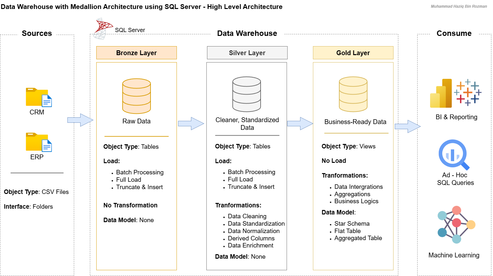
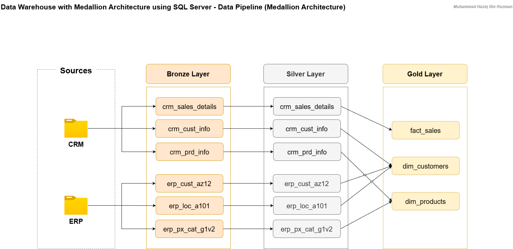

# Data Warehouse with Medallion Architecture using SQL Server

## Project Overview

A modern data warehouse built on Microsoft SQL Server that consolidates sales data from two source systems into a unified, analytics-ready data model. The warehouse follows the Medallion Architecture (Bronze → Silver → Gold), enabling structured data ingestion, transformation, and consumption for business intelligence and reporting.

| Detail | Description |
|---|---|
| Database | Microsoft SQL Server |
| Tool | SQL Server Management Studio (SSMS) |
| Architecture | Medallion Architecture (Bronze / Silver / Gold) |
| Data Model | Star Schema (Fact & Dimension Tables) |
| Load Method | Full Load — Truncate & Insert |
| Source Systems | CRM, ERP (CSV Files) |
| Datasets | [View Datasets](https://github.com/haziqrozman/sql-data-warehouse-project/tree/main/01_datasets) |

---

## Project Architecture



---

## Repository Structure

```
sql-data-warehouse/
│
├── 01_datasets/                        # Raw source data used for ingestion
│   ├── source_crm/                     # CRM source files
│   │   ├── cust_info.csv
│   │   ├── prd_info.csv
│   │   └── sales_details.csv
│   └── source_erp/                     # ERP source files
│       ├── CUST_AZ12.csv
│       ├── LOC_A101.csv
│       └── PX_CAT_G1V2.csv
│
├── 02_docs/                            # Project documentation and architecture references
│   ├── 01_project-requirements.pdf
│   ├── 02_data-management-approach.pdf
│   ├── 03_high-level-architecture.png
│   ├── 04_naming-conventions.pdf
│   ├── 05_data-integration-model.pdf
│   ├── 06_pipeline-medallion-architecture.png
│   └── 07_data-dictionary.pdf
│
├── 03_scripts/                         # SQL scripts organised by warehouse layer
│   ├── 01_database/                    # Database and schema initialisation
│   │   └── init_database.sql
│   ├── 02_bronze/                      # Raw ingestion — tables and load procedure
│   │   ├── create_tables_bronze.sql
│   │   └── proc_load_bronze.sql
│   ├── 03_silver/                      # Cleaning and transformation — tables, load, quality checks
│   │   ├── create_tables_silver.sql
│   │   ├── proc_load_silver.sql
│   │   └── quality_checks_silver.sql
│   └── 04_gold/                        # Analytical views and quality checks
│       ├── create_views_gold.sql
│       └── quality_checks_gold.sql
│
├── LICENSE
└── README.md
```

---

## Project Epics

### 1. Requirement Analysis
Analysed project scope, source systems, and data quality expectations to establish a clear foundation before any technical work began.

- Analyse & Understand Requirements — [Project Requirements](https://github.com/haziqrozman/sql-data-warehouse-project/blob/main/02_docs/01_project-requirements.pdf)

### 2. Design Data Architecture
Defined the data management approach and selected Medallion Architecture as the layering strategy governing data flow from raw ingestion to business-ready consumption.

- Design Data Management Approach — [Data Management Approach](https://github.com/haziqrozman/sql-data-warehouse-project/blob/main/02_docs/02_data-management-approach.pdf)
- Design Data Architecture — [High Level Architecture](https://github.com/haziqrozman/sql-data-warehouse-project/blob/main/02_docs/03_high-level-architecture.png)

### 3. Project Initialisation
Established naming conventions and provisioned the database and schema structure before development began.

- Define Naming Conventions — [Naming Conventions](https://github.com/haziqrozman/sql-data-warehouse-project/blob/main/02_docs/04_naming-conventions.pdf)
- Create Database & Schemas — [init_database.sql](https://github.com/haziqrozman/sql-data-warehouse-project/blob/main/03_scripts/01_database/init_database.sql)

### 4. Build Bronze Layer
Designed and implemented the raw ingestion layer, landing CSV source data as-is into staging tables via an automated stored procedure with execution logging and error handling.

- Create Bronze Tables — [create_tables_bronze.sql](https://github.com/haziqrozman/sql-data-warehouse-project/blob/main/03_scripts/02_bronze/create_tables_bronze.sql)
- Design & Create Data Load Stored Procedure — [proc_load_bronze.sql](https://github.com/haziqrozman/sql-data-warehouse-project/blob/main/03_scripts/02_bronze/proc_load_bronze.sql)
- Design Data Pipeline Architecture (Bronze Layer) — [Data Pipeline Architecture](https://github.com/haziqrozman/sql-data-warehouse-project/blob/main/02_docs/06_pipeline-medallion-architecture.png)

### 5. Build Silver Layer
Profiled bronze data to identify quality issues across CRM and ERP sources, then built transformation and integration logic with quality checks to validate output integrity.

- Explore & Understand Data, Design Data Integration Model — [Data Integration Model](https://github.com/haziqrozman/sql-data-warehouse-project/blob/main/02_docs/05_data-integration-model.pdf)
- Create Silver Tables — [create_tables_silver.sql](https://github.com/haziqrozman/sql-data-warehouse-project/blob/main/03_scripts/03_silver/create_tables_silver.sql)
- Design & Create Data Load Stored Procedure — [proc_load_silver.sql](https://github.com/haziqrozman/sql-data-warehouse-project/blob/main/03_scripts/03_silver/proc_load_silver.sql)
- Perform Quality Checks — [quality_checks_silver.sql](https://github.com/haziqrozman/sql-data-warehouse-project/blob/main/03_scripts/03_silver/quality_checks_silver.sql)
- Design Data Pipeline Architecture (Silver Layer) — [Data Pipeline Architecture](https://github.com/haziqrozman/sql-data-warehouse-project/blob/main/02_docs/06_pipeline-medallion-architecture.png)

### 6. Build Gold Layer
Designed a Star Schema with dimension and fact views integrating data across silver tables, validated referential integrity and surrogate key uniqueness, and documented all objects in the data dictionary.

- Create Gold Views — [create_views_gold.sql](https://github.com/haziqrozman/sql-data-warehouse-project/blob/main/03_scripts/04_gold/create_views_gold.sql)
- Perform Quality Checks — [quality_checks_gold.sql](https://github.com/haziqrozman/sql-data-warehouse-project/blob/main/03_scripts/04_gold/quality_checks_gold.sql)
- Design Data Pipeline Architecture (Gold Layer) — [Data Pipeline Architecture](https://github.com/haziqrozman/sql-data-warehouse-project/blob/main/02_docs/06_pipeline-medallion-architecture.png)
- Document Data Dictionary — [Data Dictionary](https://github.com/haziqrozman/sql-data-warehouse-project/blob/main/02_docs/07_data-dictionary.pdf)

---

## Project Technical Scope

- Full Extraction — ingested complete datasets from CSV source files into SQL Server staging tables using `BULK INSERT` with `FIRSTROW`, `FIELDTERMINATOR`, and `TABLOCK` options
- Deduplication — identified and removed duplicate records using `ROW_NUMBER() OVER (PARTITION BY ... ORDER BY ...)`
- Data Cleansing — handled NULL values with `ISNULL()` and `NULLIF()`, and removed unwanted whitespace using `TRIM()`
- Data Standardisation — decoded abbreviated source codes into descriptive values using `CASE WHEN UPPER(TRIM(...))`
- Data Normalisation — decomposed composite source keys into separate columns using `SUBSTRING()` and `REPLACE()`
- Derived Columns — generated surrogate keys using `ROW_NUMBER() OVER (ORDER BY ...)`, computed historical end dates using `LEAD() OVER (PARTITION BY ... ORDER BY ...)`, and derived calculated fields from existing columns
- Data Integration — consolidated attributes across CRM and ERP sources using `LEFT JOIN` with priority logic via `CASE WHEN` and `COALESCE()`
- Star Schema Modelling — implemented fact and dimension views across the Gold Layer with surrogate key generation and enforced referential integrity
- Full Load Strategy — applied Truncate & Insert across Bronze and Silver layers using `TRUNCATE TABLE` followed by `INSERT INTO ... SELECT`
- Stored Procedures — encapsulated load logic using `CREATE OR ALTER PROCEDURE` with per-table execution timing via `DATEDIFF()` and structured error handling via `BEGIN TRY...BEGIN CATCH` with `ERROR_MESSAGE()`, `ERROR_NUMBER()`, and `ERROR_STATE()`
- Gold Layer as Views — implemented analytical objects using `CREATE VIEW` with all transformation and join logic applied at query time

---

## Get in Touch

[](https://www.linkedin.com/in/haziqrozman/)
[](mailto:haziqrozman99@gmail.com)
